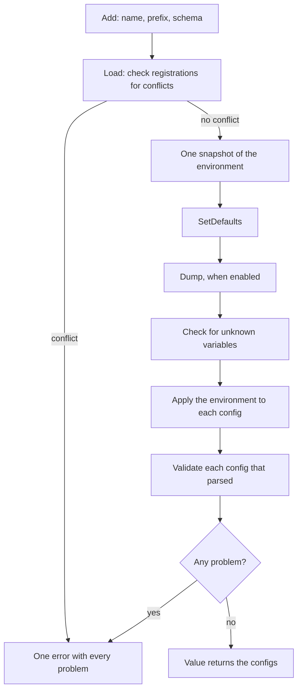

# confmaker

<p align="center"></p>

[](https://pkg.go.dev/github.com/uchaloop/confmaker) [](https://github.com/uchaloop/confmaker/actions/workflows/ci.yml) [](https://github.com/uchaloop/confmaker/tags) [](LICENSE)

[Install](#installation) · [Quick start](#quick-start) · [How it works](#how-loading-works) · [Configuration](#configuration-rules) · [Examples](#testing)

Typed configuration for Go, read from the environment and nowhere else
([12factor III](https://12factor.net/config)). A library declares its config as a
plain struct with env tags; the application loads it, and confmaker fills it,
checks the environment for typos and validates the result.

- **Defaults in code**, in `SetDefaults`, where tests and callers see them.
- **One report**: every problem of every config in one error, with suggestions
  for misspelled variables.
- **A manifest** of every variable, for a `.env.example` or a config map.
- **No framework required**; an [Fx adapter](https://github.com/uchaloop/confx) is a separate module.

## Installation

Requires Go 1.27 or later.

```bash
go get github.com/uchaloop/confmaker
```

## Quick start

A library declares what it needs and reads nothing:

```go
package store

import (
    "fmt"
    "time"

    "github.com/uchaloop/secret/v2"
)

type Config struct {
	Host     string        `env:"HOST,notEmpty"`
	Timeout  time.Duration `env:"TIMEOUT"`
	Password secret.Secret `env:"PASSWORD"`
}

// ConfigName gives the instance name, and with it the prefix STORE_.
func (Config) ConfigName() string { return "store" }

func (c *Config) SetDefaults() { c.Timeout = 30 * time.Second }

func (c Config) Validate() error {
	if c.Timeout <= 0 {
		return fmt.Errorf("timeout must be positive, got %s", c.Timeout)
	}
	return nil
}
```

The application loads it from the environment:

```bash
export STORE_HOST=db:5432
export STORE_PASSWORD=s3cr3t
```

```go
cfg, err := confmaker.Load[store.Config]()
if err != nil {
	log.Fatal(err)
}
```

`cfg.Host` is `db:5432`, `cfg.Timeout` keeps its default of `30s`, and
`cfg.Password` holds the secret without ever printing it.

## Multiple configurations

An application with several configs registers them on one `Loader` and loads
them together, so one error reports the problems of all of them. The same type
can be loaded twice under different names:

```go
loader := confmaker.MakeLoader()
primary := loader.Add[store.Config]()                              // STORE_*
replica := loader.Add[store.Config](confmaker.WithName("replica")) // REPLICA_*
cache := loader.Add[cache.Config]()                                // CACHE_*

if err := loader.Load(); err != nil {
	log.Fatal(err)
}

primaryCfg, _ := primary.Value()
replicaCfg, _ := replica.Value()
cacheCfg, _ := cache.Value()
```

`WithName` sets the instance name and prefix; `WithPrefix` changes only the
prefix.

## How loading works



- An invalid registration, such as a bad tag, is reported, and the other
  configs are still checked.
- A dump that fails is reported too; it does not stop the other checks.
- After an error no config is handed out. Calling `Load` again returns the same
  result without reading the environment again.

A report reads like this:

```text
unknown configuration variable "STORE_HSOT" (did you mean "STORE_HOST"?)
config "store": required variable "STORE_HOST" is not set
config "cache": variable "CACHE_TTL": "soon" is not a duration such as "30s" or "5m"
```

## Configuration rules

| Tag | Meaning |
|---|---|
| `env:"NAME"` | the field reads `<PREFIX>NAME` |
| `env:"NAME,required"` | the variable must be set; `NAME=` is allowed |
| `env:"NAME,notEmpty"` | the variable must be set to non-empty text (JSON `[]` is non-empty text) |
| `env:"-"` | the field and anything nested in it are not configuration |
| `envPrefix:"POOL_"` | on a struct field without `env`: extends the prefix for its fields |
| `envSeparator:";"` | splits slice elements and map entries (default `,`) |
| `envKeyValSeparator:"="` | splits a map key from its value (default `:`) |
| `envFormat:"json"` | reads the field as JSON |

Supported types, how empty values are read, what is refused at registration and
the other details are in the
[package documentation](https://pkg.go.dev/github.com/uchaloop/confmaker).

## JSON values

A field tagged `envFormat:"json"` reads a struct, slice or map from one variable:

```go
type Config struct {
	Endpoints []Endpoint `env:"ENDPOINTS" envFormat:"json"`
}

type Endpoint struct {
	URL     string        `json:"url"`
	Timeout time.Duration `json:"timeout"`
}
```

```text
STORE_ENDPOINTS=[{"url":"http://a:9000","timeout":"30s"}]
```

> [!IMPORTANT]
> A JSON environment value replaces the whole field; it does not merge with defaults.

If the default had a timeout and the variable writes only `{"url":"http://a"}`,
the timeout is zero - check such values in `Validate`. Unknown members are
errors unless a JSON tag option such as `case:ignore` or an `embed` map says
otherwise, and durations are strings such as `"30s"`.

## Manifest and dump

`Manifest` lists the variables a config reads, with their defaults. It does not
read the environment, but it calls `SetDefaults` and renders each default:

```go
variables, err := confmaker.Manifest[store.Config]()
```

Printing each `Name=Default` gives this list of variables and their values (not
an escaped shell script: quote values yourself for shell or YAML):

```text
STORE_HOST=
STORE_TIMEOUT=30s
STORE_PASSWORD=
```

`WithDump` prints, while loading, each variable with its ENV value or default
and where it came from:

```go
loader := confmaker.MakeLoader(confmaker.WithDump(os.Stdout))
```

```text
INSTANCE  VARIABLE        TYPE           VALUE    SOURCE
store     STORE_HOST      string         db:5432  env
store     STORE_PASSWORD  secret.Secret  (set)    env
store     STORE_TIMEOUT   time.Duration  30s      default
```

> [!NOTE]
> Fields of a secret type are never printed.
 A password written into a plain
string, such as a URL, is not recognised as a secret: keep it in its own
`secret.Secret` field.

## Testing

`WithEnv` loads from a map instead of the process environment, so a test needs no
`t.Setenv` and can run in parallel:

```go
func TestStore(t *testing.T) {
	t.Parallel()

	cfg, err := confmaker.Load[store.Config](confmaker.WithEnv(map[string]string{
		"STORE_HOST": "localhost",
	}))
	if err != nil {
		t.Fatal(err)
	}
	// ...
}
```

`Validate` may return several problems at once; the optional
[validate](https://github.com/uchaloop/validate) module is one way to collect
them.

## Documentation

- [confmaker](https://pkg.go.dev/github.com/uchaloop/confmaker): tags, types,
  loading, manifest and dump.
- [confx](https://pkg.go.dev/github.com/uchaloop/confx): the Fx adapter.


## Recommended configuration

> [!TIP]
> We recommend [confmaker](https://github.com/uchaloop/confmaker) for typed ENV
> configuration and [confx](https://github.com/uchaloop/confx) for its Fx integration.
> Configuration loading stays in the application; it is optional for the work libraries.

<details>
<summary><strong>Configure from ENV with confmaker / confx</strong></summary>

The pair separates configuration declarations from application wiring. A
library declares an ordinary struct; the application chooses how to load it:

```go
type Config struct {
    Port int `env:"PORT"`
}

func (Config) ConfigName() string { return "server" }
func (c *Config) SetDefaults() { c.Port = 8080 }
```

Without Fx:

```go
cfg, err := confmaker.Load[Config]() // SERVER_PORT, default 8080
```

With Fx:

```go
confx.Module(),
confx.Provide[Config](),
```

Import `github.com/uchaloop/confmaker` for the loader or
`github.com/uchaloop/confx` for the Fx adapter.

</details>

## Related libraries

| Library | Purpose |
|---|---|
| [confx](https://github.com/uchaloop/confx) | Provide configurations through Fx |
| [secret](https://github.com/uchaloop/secret) | Explicit secret values |

## Acknowledgements

Thanks also to the authors of [caarlos0/env](https://github.com/caarlos0/env)
for the tag conventions and implementation ideas that informed confmaker.

## License

[MIT](LICENSE)
