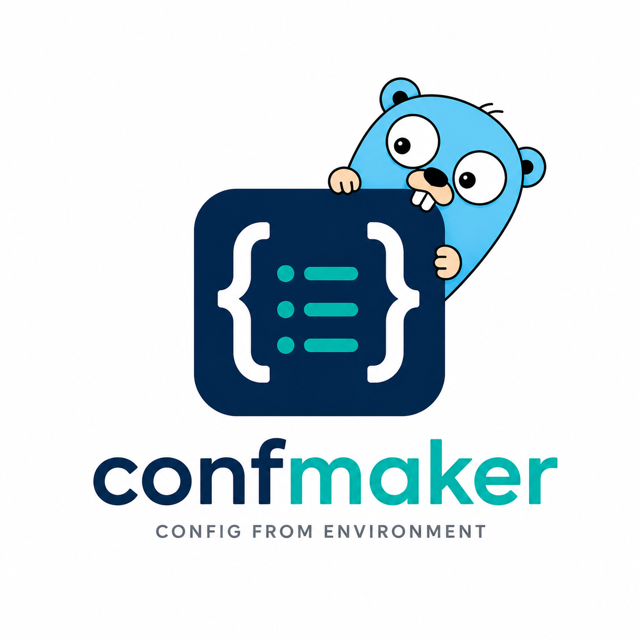

<p align="center">
  
</p>

<p align="center">
  <a href="https://github.com/uchaloop/confmaker/actions/workflows/ci.yml"></a>
  <a href="https://pkg.go.dev/github.com/uchaloop/confmaker"></a>
  <a href="LICENSE"></a>
</p>

Typed configuration for Go services, read from the environment and nowhere else
([12factor III](https://12factor.net/config)). Each library, each package and the
application itself declares the config it needs as a plain struct; confmaker
fills it, validates it, and hands it to Uber Fx.

- **Defaults in code**, where the library's tests and callers see the same values
  a deployment starts from - not in a tag only the loader can read.
- **A misspelled variable fails the start**, with a suggestion, instead of
  quietly leaving a field at its default.
- **What a declaration gets wrong is refused when it is bound** - on the first
  start, whether or not the environment happens to set that variable.
- **A manifest of every variable** the application reads, so a `.env.example` or
  a config map is generated from the types themselves.
- **Two dependencies**: Fx and a secret type.

```bash
go get github.com/uchaloop/confmaker
```

## Quick start

A library declares what it needs and reads nothing:

```go
type Config struct {
	Host     string        `env:"HOST,notEmpty"`
	Timeout  time.Duration `env:"TIMEOUT"`
	Password secret.Secret `env:"PASSWORD"`
}

func (c *Config) SetDefaults() { c.Timeout = 30 * time.Second }

func (c Config) Validate() error {
	if c.Timeout <= 0 {
		return fmt.Errorf("timeout must be positive, got %s", c.Timeout)
	}

	return nil
}
```

The application names the instance, which gives the environment prefix:

```go
fx.New(
	confx.Module(),

	confx.Provide[store.Config]("store"),      // STORE_HOST, STORE_TIMEOUT, STORE_PASSWORD
	confx.Provide[pgfx.Config]("postgres"),    // POSTGRES_HOST, POSTGRES_POOL_MAX_CONNS, ...
	confx.ProvideNamed[pgfx.Config]("replica"),// REPLICA_HOST, ...

	store.Module,
	pgfx.Module,
)
```

`Provide` gives the container an untagged value, the single default instance;
`ProvideNamed` gives it a value tagged `name:"replica"`, so a repository can ask
for either. Nothing else in the process reads the environment.

## What it catches

`confx.Module()` compares the environment against what the `Provide` calls
declare:

```text
unknown configuration variable "POSTGRES_HSOT" (did you mean "POSTGRES_HOST"?)
```

Everything a declaration itself can get wrong is refused before any value is
read - a default written in a tag, an option the tag does not define, two fields
claiming one variable, a config nested through a pointer or a slice, a field of a
type that cannot be read from text.

Every problem is reported at once, one per line, each naming the config it
belongs to:

```text
config "postgres": required variable "POSTGRES_HOST" is not set
config "postgres": timeout must be positive
```

## What it prints

`confx.Module(confx.WithDump(os.Stdout))` writes what the application actually
read:

```text
INSTANCE  VARIABLE                 TYPE           VALUE     SOURCE
postgres  POSTGRES_HOST            string         db:5432   env
postgres  POSTGRES_PASSWORD        secret.Secret  (set)     env
postgres  POSTGRES_POOL_MAX_CONNS  int32          2         default
```

A secret is never printed: not here, not in the manifest, not in the error for a
value that would not parse.

## What it generates

`confx.Manifest` resolves the same list without building an application:

```go
variables, err := confx.Manifest[pgfx.Config]("postgres")
```

```text
POSTGRES_HOST=
POSTGRES_POOL_MAX_CONNS=2
POSTGRES_PASSWORD=
```

Each entry carries its Go type, whether it is required, whether it holds a
secret, and its default rendered as text the variable could carry back. It is the
same traversal that fills the config, so a variable it lists is exactly a
variable the config reads.

## Documentation

The tags, the rules and the reasons behind them are in the package documentation:
**[pkg.go.dev/github.com/uchaloop/confmaker/confx](https://pkg.go.dev/github.com/uchaloop/confmaker/confx)**.

## Acknowledgements

I am grateful to the authors of [Uber Fx](https://github.com/uber-go/fx), and to
the authors of [env](https://github.com/caarlos0/env), whose tag vocabulary this
library follows and whose implementation it learned from.

## License

[MIT](LICENSE)
