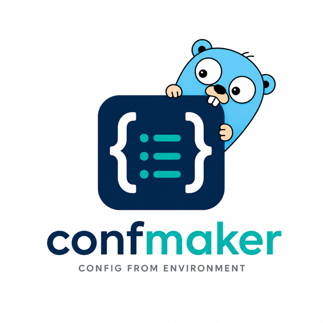
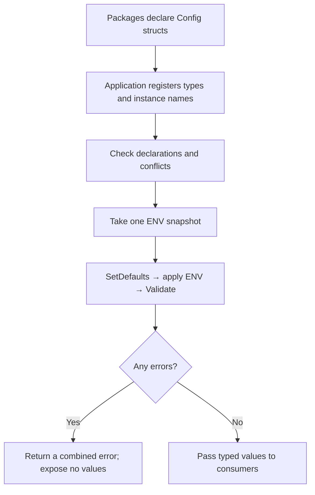

# confmaker

<p align="center"></p>

[](https://pkg.go.dev/github.com/uchaloop/confmaker) [](https://github.com/uchaloop/confmaker/actions/workflows/ci.yml) [](https://github.com/uchaloop/confmaker/tags) [](LICENSE)

**Explicit, centralized configuration for Go applications.** Packages declare
what they need; the application registers their configs, loads ENV once and
passes typed values to consumers. The core works independently of any framework;
[confx](https://github.com/uchaloop/confx) adapts it to Uber Fx.

> [!NOTE]
> confmaker supports the [Twelve-Factor Config](https://12factor.net/config)
> approach: declare typed configuration in code and supply deployment-specific
> values through ENV. Prefixes organize independent variables, not environment
> profiles. Keep credentials and deployment-specific settings out of code
> defaults; manifest and exports describe configuration rather than replace ENV.

[Install](#installation) · [Quick start](#quick-start) · [How it works](#how-it-works) · [Rules](#configuration-rules) · [Manifest](#manifest-and-configuration-documentation) · [Diagnostics](#load-reports) · [Reference](#reference)

## Installation

Requires **Go 1.27 or later**. The command below installs the tagged release.

```sh
go get github.com/uchaloop/confmaker@v0.8.0
```

```go
import "github.com/uchaloop/confmaker"
```

The library reads ENV. It does not automatically load `.env` files, contact
secret stores or start services. Set variables through your IDE, shell or deploy
system.

## Quick start

In a real application, `StoreConfig` and `JobConfig` below belong to their
respective packages. They need no dependency on confmaker. The application owns
the explicit registration list.

```go
package main

import (
	"fmt"
	"log"
	"time"

	"github.com/uchaloop/confmaker"
)

type StoreConfig struct {
	Host    string        `env:"HOST,notEmpty" envDescription:"Database address"`
	Timeout time.Duration `env:"TIMEOUT" envDescription:"Database operation timeout"`
}

func (c *StoreConfig) SetDefaults() { c.Timeout = 30 * time.Second }

func (c StoreConfig) Validate() error {
	if c.Timeout <= 0 {
		return fmt.Errorf("timeout must be positive")
	}
	return nil
}

type JobConfig struct {
	Workers int `env:"WORKERS"`
}

func (c *JobConfig) SetDefaults() { c.Workers = 2 }

func main() {
	if err := run(); err != nil {
		log.Fatal(err)
	}
}

func run() error {
	loader := confmaker.MakeLoader()
	store := loader.Register[StoreConfig]("postgres")
	job := loader.Register[JobConfig]("job")

	if err := loader.Load(); err != nil {
		return err
	}

	storeConfig, err := store.Value()
	if err != nil {
		return err
	}
	jobConfig, err := job.Value()
	if err != nil {
		return err
	}

	// Pass these values to the store and job constructors.
	fmt.Println(storeConfig.Host, storeConfig.Timeout, jobConfig.Workers)
	return nil
}
```

Run with `POSTGRES_HOST` set in your IDE, or from a shell:

```sh
export POSTGRES_HOST=localhost:5432
go run .
```

Output: `localhost:5432 30s 2`. Unset optional fields retain their defaults.
For a single configuration, use `confmaker.Load[StoreConfig]("postgres")`.

## How it works


```mermaid
flowchart TD
    A["Packages declare Config structs"] --> B["Application registers types and instance names"]
    B --> C["Check declarations and conflicts"]
    C --> D["Take one ENV snapshot"]
    D --> E["SetDefaults → apply ENV → Validate"]
    E --> F{"Any errors?"}
    F -->|Yes| G["Return a combined error; expose no values"]
    F -->|No| H["Pass typed values to consumers"]
```

`Register` compiles the schema; errors are reported by `Load` or `Manifest`.
`Load` checks all valid registrations, including ones with no consumer. Conflicts
between registrations stop loading before defaults run. Unknown variables are
checked under registered prefixes; unrelated ENV variables are ignored.

`Load` runs once. Later calls return the same result. All handles remain
unavailable until the whole set loads successfully. A failed configuration
prevents values from being handed out for the entire set.

## Names and multiple instances

The instance name is explicit and determines the default ENV prefix:

| Registration | ENV prefix |
|---|---|
| `Register[StoreConfig]("postgres")` | `POSTGRES_` |
| `Register[StoreConfig]("read-replica")` | `READ_REPLICA_` |
| `Register[StoreConfig]("replica", confmaker.WithPrefix("READ_DB_"))` | `READ_DB_` |

Register the same type more than once under different names when configuring
independent instances. Names contain lowercase letters, digits and `_`, `-`, `.`;
they must start and end with a letter or digit. Names, resolved prefixes and
full variable names must not collide. There is no implicit `ConfigName()` lookup.

`WithPrefix` changes ENV names, not the instance name. Config options apply to
one registration; ENV options such as `WithEnv`, `WithDump` and `AllowUnknown`
apply to the loader.

## Configuration rules

| Tag | Meaning |
|---|---|
| `env:"HOST"` | Read `<PREFIX>HOST`; absence retains the default |
| `env:"HOST,required"` | ENV must contain the variable; empty text must still be parseable |
| `env:"HOST,notEmpty"` | ENV must contain non-empty text |
| `env:"-"` | Ignore the field and everything inside it |
| `envPrefix:"POOL_"` | Extend the prefix for a nested config held by value |
| `envDescription:"Database address"` | Description for manifest and exports |
| `envSeparator:";"` | Separator for a plain slice or map; default `,` |
| `envKeyValSeparator:"="` | Key/value separator for a plain map; default `:` |
| `envFormat:"json"` | Read a structured value from one JSON variable |

Defaults belong in `SetDefaults`, not `envDefault` tags. Only the root config's
`SetDefaults` and `Validate` methods run; explicitly compose nested defaults or
validation there when needed. `Validate` runs only after all fields of that
configuration parse successfully. There is no tag that makes all nested fields
required: mark individual fields.

Strings, bools, integers, floats, durations, text-unmarshalable types, scalar
pointers, and supported slices/maps can be read in plain syntax. Examples:
`30s`, `host-a,host-b`, `team:core,env:dev`.

For structured data, a field such as
`Endpoints []Endpoint` with `env:"ENDPOINTS" envFormat:"json"` reads one variable.
A supplied JSON value replaces the whole default, rather than merging with it.
JSON durations use strings such as `"30s"`. See [GoDoc](https://pkg.go.dev/github.com/uchaloop/confmaker)
for JSON rules, custom types and supported shapes.

## Errors and diagnostics

The original error is the complete result. Structured problems let callers
inspect configuration failures without parsing messages:

```go
if err := loader.Load(); err != nil {
	for _, problem := range confmaker.ConfigErrors(err) {
		fmt.Printf("%s: config=%s variable=%s field=%s: %v\n",
			problem.Kind, problem.InstanceName, problem.VariableName,
			problem.FieldPath, problem)
	}
	return err
}
```

Categories distinguish declarations, conflicts, missing or empty variables,
parsing, unknown variables, validation and default rendering. `errors.As` finds
the first `*confmaker.ConfigError`. `ConfigErrors` collects structured problems
through wrappers and joins; a joined user `Validate` error remains one validation
problem. Treat returned error pointers as read-only.

Original non-secret causes remain available through `errors.Is` and `errors.As`,
including `strconv.ErrSyntax`, `strconv.ErrRange` and `*strconv.NumError`.
Writer and lifecycle errors are separate, so always handle the original error
even if `ConfigErrors` returns no entries.

`confmaker.WithDump(writer)` prints values and their sources during loading.
It runs before parsing/validation completes: a dump is diagnostic output, not
proof of success. Secret types are masked. Ordinary strings and user validation
messages are not automatically sanitized.

## Load reports

Manifest describes declarations; diagnostics describe one actual load. Enable
collection explicitly to inspect sources and results without recording values:

```go
diagnostics := confmaker.MakeDiagnostics()
loader := confmaker.MakeLoader(confmaker.WithDiagnostics(diagnostics))
loader.Register[StoreConfig]("store")

err := loader.Load()
report := diagnostics.Report() // Available even when err != nil.
_ = report                    // Inspect or format it in application code.
if err != nil {
    return err
}
```

`LoadReport` contains registration names, types, field paths, sources, statuses
and structured `LoadProblem` categories. It contains no values, defaults, error
messages or error causes. The original error returned by `Load` remains unchanged.
`WithDump` is different: it prints values of non-secret fields.

| Source | Meaning |
| --- | --- |
| `env` | ENV is present, including empty or invalid input |
| `default` | ENV is absent and an optional field retains a nonzero default |
| `zero` | ENV is absent and an optional field retains its zero value |
| `missing` | Required ENV is absent, even if the field has a default |
| `unknown` | The field was not processed |

An explicit zero in `SetDefaults` is indistinguishable from an untouched zero.
Field success means ENV application succeeded; `Validate` may still fail the
config. Global problems can fail loading even when individual configs succeeded.
`Problems` contains structured library errors; an unstructured error, such as a
dump writer failure, can fail the load without adding a problem category. Writer
error chains are not inspected; handle the original load error for those failures.

All registrations are included, even invalid ones. Fields unavailable because
schema compilation failed cannot be listed. Conflicts leave fields unprocessed.
Before loading, `Report` returns `LoadNotStarted`; during loading it returns
`LoadInProgress` without partial results. Finished reports are independent copies
and safe to read concurrently. One Diagnostics receiver belongs to one loader;
reusing it for another loader is a declaration error. Repeated `Load` calls reuse
the original result and do not run handlers again. Manifest exports do not collect
load diagnostics.

For immediate processing, including `fx.New(...).Run()`, use a handler instead
of a receiver, or combine both options:

```go
confmaker.WithDiagnosticHandler(func(report confmaker.LoadReport) {
    // Send selected metadata to your application's logger or metrics.
})
```

The handler runs synchronously after completion is published and before the
executing `Load` returns, on success or error. It may read handles and reports or
call `Load` again. Concurrent waiting callers may return before the handler ends.
A loading panic propagates, stores `LoadPanicked` in the receiver, and skips the
handler. Problems from completed stages remain available; an interrupted stage
may have incomplete results. A handler panic propagates without changing the completed load result.
Neither option logs automatically or terminates the process.

## Testing

Use `WithEnv` to replace the process environment with an isolated map. The map is
copied when the option is created; `WithEnv(nil)` means an empty environment.

```go
func TestStoreConfig(t *testing.T) {
	t.Parallel()

	cfg, err := confmaker.Load[StoreConfig]("postgres", confmaker.WithEnv(map[string]string{
		"POSTGRES_HOST": "localhost:5432",
	}))
	if err != nil {
		t.Fatal(err)
	}
	if cfg.Timeout != 30*time.Second {
		t.Fatalf("unexpected timeout: %s", cfg.Timeout)
	}
}
```

This test uses `StoreConfig` from the quick start and imports `testing` and
`time`. No process-wide ENV changes are needed.

## Manifest and configuration documentation

### What it describes

A manifest describes **what the application declares**: config instances,
resolved prefixes, ENV names, Go types, required/secret flags, defaults and
field descriptions. It is not a snapshot of the application's actual settings.

Use it to inspect the full configuration surface, generate a reference for
local setup, publish documentation or supply metadata to external tools.
Ordinary application loading does not require it.

### Use the same registrations

After registration, choose either loading or description generation. For
example, add this branch before `loader.Load()` in the quick start's `run`:

```go
if *showManifest {
	return loader.WriteManifestMarkdown(os.Stdout)
}
```

Define `showManifest` with `flag.Bool("manifest", false, "Print configuration documentation")`
at package scope, import `flag` and `os`, and call `flag.Parse()` in `main` before
`run`. Then `go run . -manifest` prints documentation without loading ENV or
starting your services. Keep service construction after the normal load path.
No second list of registrations is needed in this core-library example.

For programmatic access after registration:

```go
configs, err := loader.Manifest() // []confmaker.ConfigManifest
if err != nil {
	return err
}
for _, config := range configs {
	fmt.Println(config.InstanceName, config.Prefix)
	for _, variable := range config.Variables {
		fmt.Println(variable.Name, variable.Required, variable.Description)
	}
}
```

`confmaker.Manifest[StoreConfig]("postgres")` describes a single type instead.
`Loader.Manifest` also checks conflicts between all registered configurations.
The same names and options describe the same ENV variables.

### Optional CLI helper

To avoid repeating format selection, register a helper on your FlagSet:

```go
describe := confmaker.MakeDescribeFlag(flag.CommandLine)
flag.Parse()

loader := confmaker.MakeLoader()
loader.Register[StoreConfig]("postgres")
loader.Register[JobConfig]("job")

if describe.Requested() {
    return describe.Write(loader, os.Stdout)
}
// Continue with normal loading or pass the loader to confx.
```

Use `-describe=env`, `-describe=markdown` or `-describe=json`. Omission selects
normal startup; an unknown or empty format is a flag parsing error. The helper
does not parse flags or exit the process itself: your FlagSet controls error
handling. It registers only on the supplied FlagSet, not in init. Use a dedicated
FlagSet with ContinueOnError when the caller needs to handle parse errors.

### Choose an output

| Task | API |
|---|---|
| Inspect metadata in Go | `loader.Manifest()` |
| Generate an ENV reference | `loader.WriteEnvExample(writer)` |
| Publish a documentation table | `loader.WriteManifestMarkdown(writer)` |
| Feed external tools | `loader.WriteManifestJSON(writer)` |

All exporters accept `io.Writer`; the caller opens and closes files. Generate
into a buffer first if an existing file must not be truncated on generation
failure. Writer failures can still leave partial output.

An `.env.example` is a reference to keep in version control, not a secrets file
or an automatically loaded configuration source. For the quick start's store:

```dotenv
# Configuration: "postgres"
# Database address
# Required; must not be empty.
# POSTGRES_HOST=

# Database operation timeout
POSTGRES_TIMEOUT=30s
```

Safe non-zero scalar defaults become active assignments. Secrets, complex values
and values requiring quoting become commented placeholders. Explicit zero,
false and empty-string defaults cannot be distinguished from absent defaults.
The template is not a shell script or a guarantee of compatibility with every
dotenv parser.

Markdown contains one section per config and a table of variables. JSON uses
fixed camelCase keys, two-space indentation and a versioned envelope:

```json
{
  "version": 1,
  "configs": []
}
```

Config entries contain `instanceName`, `prefix` and `variables`. Variable entries
contain `name`, `description`, `type`, `required`, `notEmpty`, `secret`,
`hasDefault` and, for non-secret fields, `default`. Empty lists are arrays.
Consumers should check `version`. Neither camelCase nor snake_case is mandated
by JSON itself; camelCase is this exporter's contract.

### Guarantees and boundaries

- Configs are ordered by instance name; variables retain declaration order.
- Manifest reads no ENV, calls no `Validate`, writes no dump and does not make
  handles ready. It can run before or after `Load`, including a failed load.
- Each call evaluates fresh defaults and their marshalers. Keep those methods
  deterministic and free of side effects; concurrent calls require safe methods.
- Secret defaults are never rendered. Use a type from
  [secret](https://github.com/uchaloop/secret), not an ordinary string containing
  credentials. Descriptions are public documentation too.
- Manifest and all exporters are strict: an invalid declaration, conflict or
  unrepresentable default fails the whole description before output is written.
  A commented placeholder does not bypass that check.
- Manifest does not verify Vault keys, deploy settings or service availability.
  Such checks belong to external tools consuming its metadata.

## Important behavior

| Rule | Why |
|---|---|
| Defaults do not satisfy `required` or `notEmpty` | These tags require the deployment to supply ENV |
| `notEmpty` checks text, not the decoded value | JSON `[]` is non-empty text; domain limits belong in `Validate` |
| Nested configs are held by value | Their structure must not depend on allocation or collection contents |
| Scalar pointers are supported; pointer-only type cycles are rejected | A parser must eventually reach a concrete value |
| Plain ENV maps reject pointer keys and non-reflexive keys such as `NaN` | Address identity or `NaN != NaN` would defeat duplicate checks; NaN values remain supported |
| Map keys and values are not silently trimmed | Whitespace must not change configuration unnoticed |
| Plain collection defaults cannot contain nil pointer chains or ambiguous separators | The description must not silently change their meaning |
| Defaults with unrepresentable text can still load without `WithDump` | Normal loading does not need to render defaults |
| Loaded configs are read-only by convention | Returned structs may share maps, slices and pointers |
| Unknown variables are checked only under registered prefixes | Unrelated process settings belong to other components; use `AllowUnknown` for explicit exceptions |

## Reference

- [GoDoc](https://pkg.go.dev/github.com/uchaloop/confmaker): complete API and type rules.
- [confx](https://github.com/uchaloop/confx): the Uber Fx adapter.
- [Changelog](CHANGELOG.md): changes and migration notes.

## Acknowledgements

Thanks to the authors of [caarlos0/env](https://github.com/caarlos0/env) for the
tag conventions and implementation ideas that informed confmaker.

## License

[MIT](LICENSE)
